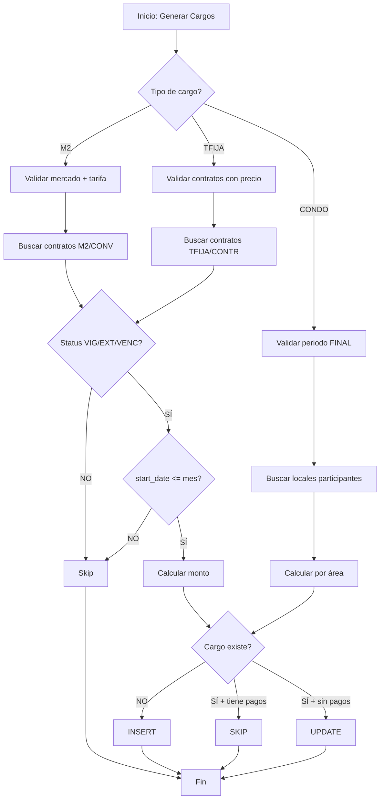

# Reglas de Negocio: Generación de Cargos de Renta

## 📋 Índice

1. [Resumen Ejecutivo](#resumen-ejecutivo)
2. [Tipos de Cargos](#tipos-de-cargos)
3. [Reglas por Modalidad](#reglas-por-modalidad)
4. [Estados de Contrato](#estados-de-contrato)
5. [Casos Límite y Posibles Errores](#casos-límite-y-posibles-errores)
6. [Validaciones Críticas](#validaciones-críticas)

---

## Resumen Ejecutivo

El sistema genera **3 tipos de cargos de renta** mensuales:

| Tipo               | Modalidad | Tipo Contrato | Calculadora           | Moneda |
| ------------------ | --------- | ------------- | --------------------- | ------ |
| **RENT_EUR_M2**    | M2        | CONV          | `RentM2Calculator`    | EUR    |
| **RENT_EUR_FIXED** | TFIJA     | CONTR         | `RentFixedCalculator` | EUR    |
| **CONDO_USD**      | N/A       | N/A           | `CondoUsdCalculator`  | USD    |

---

## Tipos de Cargos

### 1. RENT_EUR_M2 (Renta por Metro Cuadrado)

**Características:**

- Modalidad: `M2` (por metro cuadrado)
- Tipo de contrato: `CONV` (Convenio)
- Cálculo: `tarifa_diaria_m² × área_m² × (365/12)`
- Moneda: EUR

**Flujo de cálculo:**

```
1. Obtener tarifa vigente del mercado (price_per_m2_eur_minor)
2. Por cada local del contrato:
   - Multiplicar: tarifa × área × 30.42 días promedio
   - Redondear a centavos (minor units)
3. Generar 1 cargo por local
```

**Fechas:**

- `period`: Primer día del mes
- `issued_on`: Primer día del mes
- `due_on`: Día 6 del mes

---

### 2. RENT_EUR_FIXED (Renta Fija Mensual)

**Características:**

- Modalidad: `TFIJA` (Tarifa Fija)
- Tipo de contrato: `CONTR` (Contrato estándar)
- Cálculo: `monthly_price_eur` dividido entre locales del contrato
- Moneda: EUR

**Flujo de cálculo:**

```
1. Obtener monthly_price_eur del contrato
2. Contar locales activos del contrato
3. Dividir el precio mensual:
   - base_amount = monthly_price_eur ÷ num_locales
   - remainder = monthly_price_eur - (base_amount × num_locales)
   - Primer local recibe: base_amount + remainder
   - Resto reciben: base_amount
4. Generar 1 cargo por local
```

**Fechas:**

- `period`: Primer día del mes
- `issued_on`: Día de facturación del contrato (`billing_day`, default: 1)
- `due_on`: Mismo día que `issued_on`

**Particularidad Path A vs Path B:**

- **Path A (Daily):** Genera solo para contratos con `billing_day` = día específico
- **Path B (Monthly):** Genera para todos los contratos del mes según su `billing_day`

---

### 3. CONDO_USD (Condominio en Dólares)

**Características:**

- No depende de contratos
- Cálculo: Gastos del período ÷ área total participante
- Moneda: USD

**Flujo de cálculo:**

```
1. Verificar que el período esté FINAL
2. Sumar gastos activos del período (condo_expenses)
3. Calcular área total participante:
   - Todos los locales activos del mercado
   - EXCEPTO aquellos marcados como excluded (condo_participants con included=false)
4. Calcular costo unitario: total_gastos ÷ total_área
5. Por cada local participante:
   - Si tiene snapshot de área: usar snapshot
   - Si no: usar área actual del local
   - cargo = costo_unitario × área
```

**Fechas:**

- `period`: Primer día del mes
- `issued_on`: Primer día del mes
- `due_on`: Día 5 del mes

---

## Reglas por Modalidad

### 🔑 Regla Fundamental de Elegibilidad de Contratos

**Los contratos generan cargos SI Y SOLO SI:**

```
✅ status IN ('VIG', 'EXT', 'VENC')
✅ start_date <= último_día_del_mes
✅ deleted_at IS NULL
✅ local.deleted_at IS NULL
❌ NO se verifica end_date
```

**⚠️ IMPORTANTE:** El campo `end_date` **NO** afecta la generación de cargos. Un contrato con `end_date` en el pasado seguirá generando mientras su `status` sea `VIG`, `EXT` o `VENC`.

### Estados de Contrato y su Comportamiento

| Estado        | Código      | Genera Cargos | Lógica                                   |
| ------------- | ----------- | ------------- | ---------------------------------------- |
| **Vigente**   | `VIG`       | ✅ SÍ         | Contrato activo normal                   |
| **Extensión** | `EXT`       | ✅ SÍ         | Renovación o extensión                   |
| **Vencido**   | `VENC`      | ✅ SÍ         | Contrato pasado end_date pero no cerrado |
| **Terminado** | `TERMINADO` | ❌ NO         | Contrato cerrado definitivamente         |

**Filosofía del sistema:**

- El `status` representa el **estado administrativo** del contrato
- El `end_date` es **informativo/histórico**, no restrictivo
- Solo cuando el contrato se marca como `TERMINADO` deja de generar cargos

---

## Casos Límite y Posibles Errores

### 1. ⚠️ Contratos con end_date vencido pero status VIG

**Situación:**

```sql
Contract:
  status = 'VIG'
  start_date = '2024-08-01'
  end_date = '2025-08-01'  -- Ya pasó

Generando para: Diciembre 2025
```

**Comportamiento actual:**

- ✅ **SÍ genera cargo** para diciembre 2025
- Esto es correcto según la regla: "status VIG/EXT/VENC genera sin importar end_date"

**Posible problema de negocio:**

- Si el `end_date` debería forzar el cierre, hay inconsistencia
- **Solución:** Implementar tarea automática que cambie `VIG` → `VENC` cuando `end_date < hoy`

---

### 2. ⚠️ Contratos con múltiples locales (TFIJA)

**Situación:**

```sql
Contract #123:
  monthly_price_eur = 100.00
  Locales: [A, B, C]
```

**Comportamiento:**

- Local A: €33.34 (recibe el remainder)
- Local B: €33.33
- Local C: €33.33
- **Total: €100.00** ✅

**Riesgo:** Si se elimina un local después de generar, el total ya facturado no coincidirá con el precio del contrato.

**Mitigación:** Usar `deleted_at` soft delete y nunca hard delete.

---

### 3. ⚠️ Contratos que inician a mitad de mes

**Situación:**

```sql
Contract:
  start_date = '2025-12-15'

Generando para: Diciembre 2025
```

**Comportamiento M2:**

- ✅ **SÍ genera** cargo completo del mes
- **Problema:** Cobra todo el mes aunque el contrato empezó día 15

**Comportamiento TFIJA:**

- Depende del `billing_day`:
    - Si `billing_day = 1`: genera el día 1 (antes de start_date) → **NO generará** por validación de `c.start_date <= issuedOn`
    - Si `billing_day = 15`: genera el día 15 → ✅ **SÍ genera**

**Inconsistencia detectada:** M2 siempre genera el mes completo, TFIJA puede no generar si `billing_day` < `start_date`.

**Solución recomendada:**

- Añadir validación: `c.start_date <= issued_on` también en M2
- O prorratearmeses parciales (más complejo)

---

### 4. ⚠️ Cambios de tarifa a mitad de mes (M2)

**Situación:**

```sql
Tarifa día 1-15: €0.10/m²/día
Tarifa día 16-31: €0.15/m²/día

Generando para: Diciembre
```

**Comportamiento:**

- Usa la tarifa `is_current = true` vigente al momento de generar
- **Problema:** No prorratea si la tarifa cambió durante el mes

**Mitigación:** Generar cargos **después** de cambiar tarifas, nunca antes.

---

### 5. ⚠️ Contratos sin locales (huérfanos)

**Situación:**

```sql
Contract #456:
  status = 'VIG'
  No tiene filas en contract_local
```

**Comportamiento:**

- ❌ **NO genera cargos** (el JOIN con contract_local queda vacío)
- Esto es correcto: no hay debtor_id

**Validación recomendada:** Añadir constraint FK o check `COUNT(locals) > 0` al crear contrato.

---

### 6. ⚠️ Locales con área = 0 (M2)

**Situación:**

```sql
Local:
  area_m2 = 0
  Contract: M2/CONV
```

**Comportamiento:**

- ✅ Genera cargo de €0.00
- **Problema:** Cargo sin valor real

**Validación recomendada:** `area_m2 > 0` al asignar local a contrato M2.

---

### 7. ⚠️ Periodo de condominio en estado DRAFT

**Situación:**

```sql
CondoPeriod:
  status = 'DRAFT'

Intentando generar CONDO_USD
```

**Comportamiento:**

- ❌ **NO genera** (bloqueado en preflight y en calculadora)
- ✅ Correcto: evita generar con gastos incompletos

---

### 8. ⚠️ Discrepancia entre proyección y generación

**Situación anterior (CORREGIDA):**

- **Proyección:** filtraba contratos VIG/EXT por `end_date`
- **Generación:** ignoraba `end_date` para VIG/EXT/VENC

**Resultado:**

- Proyección: €11,841.38
- Deuda real: €12,833.14

**Solución aplicada:** Alinear ambas queries eliminando validación de `end_date` en proyección.

---

### 9. ⚠️ Contratos con monthly_price_eur = NULL o 0 (TFIJA)

**Situación:**

```sql
Contract:
  modality = 'TFIJA'
  monthly_price_eur = NULL
```

**Comportamiento:**

- ❌ **NO genera** (filtrado por `monthly_price_eur IS NOT NULL AND > 0`)
- ✅ Correcto

---

### 10. ⚠️ Regeneración de meses ya facturados

**Situación:**

- Cargo de diciembre ya existe
- Se vuelve a correr generación de diciembre

**Comportamiento:**

- Usa estrategia `UPSERT` con `uniqueColumns`:
    - **M2:** `[debtor_type, debtor_id, kind, period]`
    - **TFIJA:** `[contract_id, local_id, kind, issued_on]`
    - **CONDO:** `[condo_period_id, local_id, kind]`

**Riesgo:**

- Si el cargo ya tiene pagos asignados (`allocations`), lo **omite** (skipea)
- Si no tiene pagos, **actualiza** el monto

**Validación:** Preflight bloquea periodos < diciembre 2025 para evitar modificar historia.

---

## Validaciones Críticas

### Preflight Checks (RunController)

Antes de permitir generación, se valida:

#### RENT_EUR_M2:

```
✅ Mercado existe y está activo
✅ Existe tarifa vigente (is_current = true) con precio > 0
✅ Existen contratos M2/CONV con status VIG/EXT/VENC
✅ Contratos tienen start_date <= fin_del_mes
✅ Periodo >= 2025-12-01 (no regenerar historia)
```

#### RENT_EUR_FIXED:

```
✅ Existen contratos TFIJA/CONTR con status VIG/EXT/VENC
✅ Contratos tienen monthly_price_eur > 0
✅ Contratos tienen start_date <= fin_del_mes
✅ Periodo >= 2025-12-01
```

#### CONDO_USD:

```
✅ Mercado existe y está activo
✅ Existe periodo de condominio para ese mes y mercado
✅ Periodo de condominio está en status FINAL
✅ Periodo tiene gastos cargados (sum > 0)
✅ Hay locales participantes con área > 0
```

---

## Diagrama de Flujo



---

## Conclusión y Recomendaciones

### ✅ Estado Actual (Post-corrección)

1. **Generación de cargos:** Alineada con regla de negocio (ignora `end_date`, usa solo `status`)
2. **Proyección de ingresos:** Alineada con generación real
3. **Coherencia:** Deuda total = Renta proyectada cuando no hay pagos

### 🔧 Mejoras Recomendadas

1. **Automatización de estados:**

    - Cron job que cambie `VIG` → `VENC` cuando `end_date < hoy`
    - Alerta cuando contrato `VENC` lleva > 30 días sin cierre

2. **Validaciones adicionales:**

    - Constraint: contratos M2 deben tener locales con `area_m2 > 0`
    - Constraint: contratos TFIJA deben tener `monthly_price_eur > 0`
    - Bloquear eliminación de locales si tienen cargos abiertos

3. **Prorrateo de meses parciales:**

    - Implementar para contratos que inician/terminan a mitad de mes
    - Evitar cobros de meses completos por periodos parciales

4. **Histórico de tarifas:**

    - Guardar `fx_rate` y tarifa usada en el cargo
    - Permitir auditar qué tarifa se aplicó en cada mes

5. **Dashboard mejorado:**
    - Mostrar contratos "en riesgo" (VENC hace > 30 días)
    - Alertar contratos con `end_date` vencido pero status VIG

---

**Documento generado:** 2025-12-22  
**Versión:** 1.0  
**Autor:** Sistema Mercach - Análisis de Cascade AI
